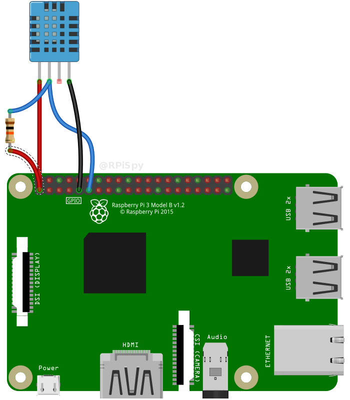
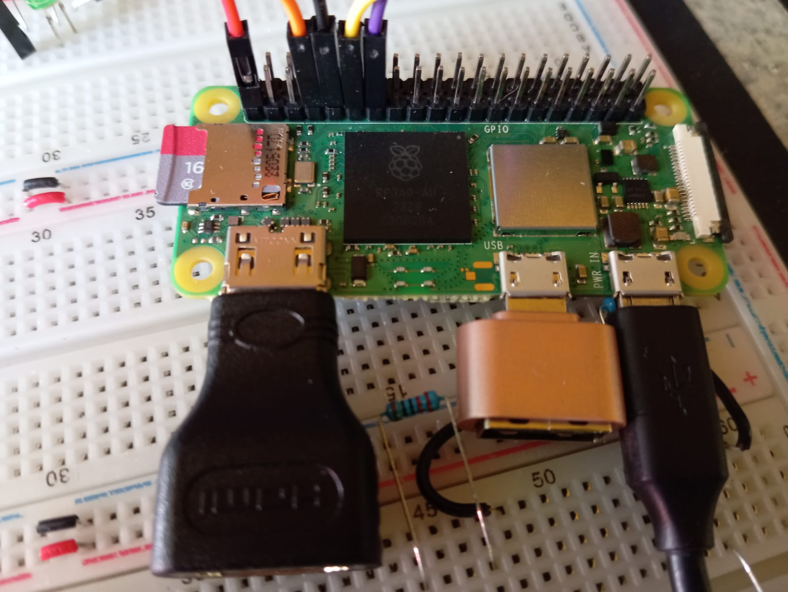
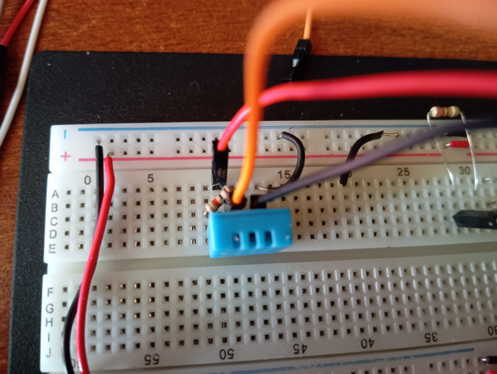
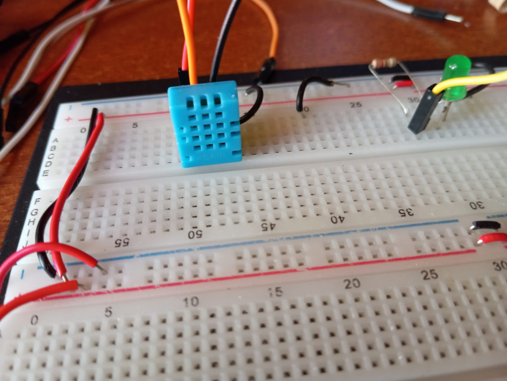
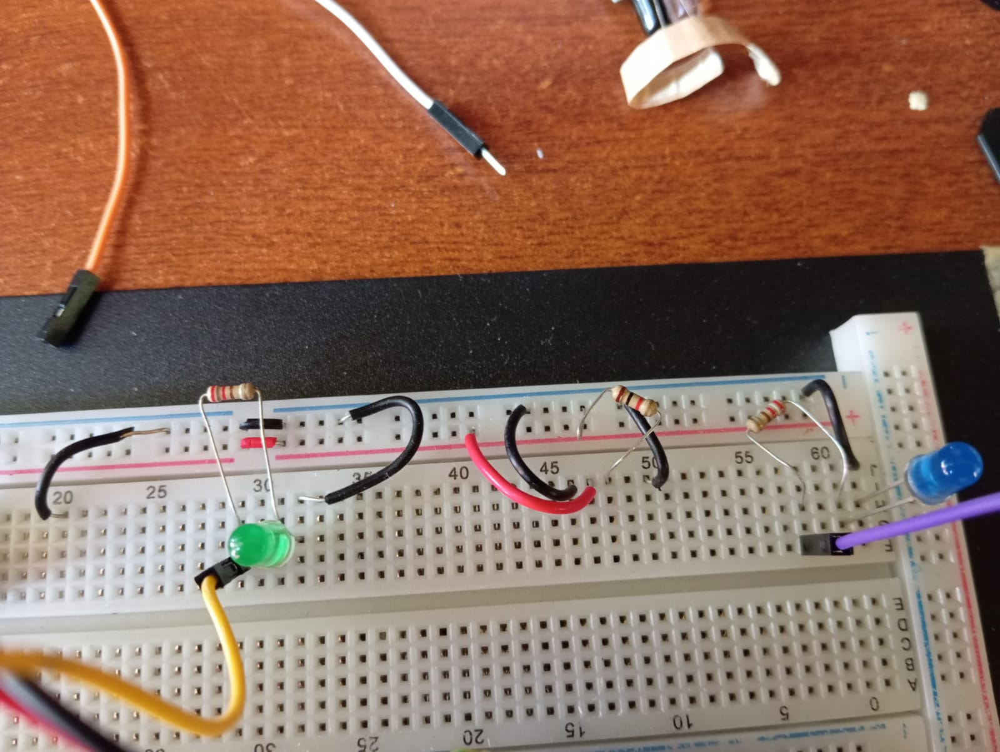

# Ejemplo 01/03/2025

En el ejemplo de este laboratorio se hizo uso del sensor de temperatura que publica hacia un tópico en HiveMQ usando el protocolo MQTT, esta información de la temperatura la usa una pagina web que muestra en una grafica esta temperatura. También desde la pagina web se pueden controlar 2 LEDs, uno verde y uno azul.

## PASOS PARA LA RASPBERRY

1. Instalar usando Raspberry Pi Imager
	- Aquí se puede configurar como se vio en el video tutorial realizando la configuraciones iniciales y de hacer esto, se pueden saltar hasta el paso 5.
2. Configuraciones iniciales
3. Acceder al Wi-Fi
4. Configurar SSH
	-> Menú -> Preferencias -> Configuración de Raspberry Pi -> Interfaces -> SSH -> Aceptar
5. Crear entorno virtual
```bash
// Comando para crear entorno
python -m venv mqtt-venv
// Comando para activar el entorno
source mqtt-venv/bin/activate
// Comando para desactivar el entorno
deactivate
```

6. Instalaciones, para realizarlas tiene que estar activo el entorno
```bash
pip3 install RPi.GPIO
pip3 install paho-mqtt
pip3 install --upgrade paho-mqtt
pip3 install Adafruit_DHT --global-option=build_ext --global-option="--force-pi"
```

7. En mi caso tuve que modificar un archivo para el sensor DHT11.
```bash
cd Desktop/mqtt-venv/lib/python3.11/site-packages/Adafruit_DHT
nano common.py
```

modificar la función que devuelve la plataforma y únicamente devolver la placa que estén usando (Raspberry Pi 5,3,0)


## Anexos

### DHT11
Conexion del sensor DHT11


El dispositivo de 4 pines requerirá que se coloque una resistencia (4,7 K-10 K) entre el pin 1 (3,3 V) y el pin 2 (datos).
| Pin DHT      | Señal        | Pin Pi        |
|--------------|--------------|---------------|
| 1            | 3,3 V        | 1             |
| 2            | Datos/Salida | (GPIO4)   |
| 3            | No utilizado | –             |
| 4            | Tierra        | 9         |


### Fotos del protobard y raspberry

Raspberry Pi


Conexiones realizadas para el DHT11


Sensor DHT11


LED's del Ejemplo


## Pasos para correr el ejemplo

1. Realizar las configuraciones fisicas de la Raspberry y de los compontes, esto incluye realizar la conexiones.
2. Correr el archivo de python que se encuentra en la carpeta `/rasberry`
3. Correr el Frontend en la computadora local este se encuentra en la carpeta `/Frontend`
	- Antes de correr el Frontend, asegurarse que tengan instalado Node
	- Seguidamente ejecutar el comando: `npm install`, para instalar todas las librerias necesarias
	- Luego ejecutar el comando: `npm run dev`